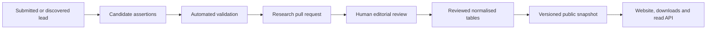

# Expansion architecture and roadmap

Status: Living expansion contract
Last updated: 3 August 2026

## Decision

The current Explore, Map, Data, Wall and Organisations structure supports the
reviewed Phase 1 release and a substantially larger registry. Software function
and organisation actor type are deliberately separate classification systems.

Growth must happen through bounded previews, stable filters, paginated records
and generated data snapshots. It must not add more text or more cards to the
initial screen.

Some possible future subjects are extensions of the current registry. Others
are separate products or datasets and require a later information-architecture
decision.

## Capacity targets

### Current reviewed release

Release `0.2.0` contains:

- 94 reviewed products;
- 64 linked organisations;
- 20 country-safe deployment records;
- 75 rights-resolved sources; and
- 1,276 reviewed assertions.

The wider Wall contains 540 classified submitted listings. A listing is not a
reviewed canonical product record unless it links to one explicitly.

### Next editorial coverage target

- approximately 100 products;
- 25 or more countries with reviewed coverage;
- 75–100 evidenced deployments;
- 12–18 categories;
- multiple evidence states on one product; and
- reviewed CSV, JSON, JSONL, GeoJSON and workbook releases.

### Engineering scale test

The public interface must also be tested with synthetic, non-published records
at:

- 500 products;
- 2,000 deployments;
- all 54 African countries;
- 50 organisations returned by one search;
- 25 categories; and
- 10 years of release metadata.

Synthetic records test display and performance only. They never enter the
research branch or public release.

## Stable public structure

| Public object | Current role | Growth rule |
| --- | --- | --- |
| Explore route | Search the complete classified catalogue | Keep submitted listings visibly distinct from reviewed records |
| Wall | Visual software orientation | Group by energy relationship, function, stage and sector; keep every tile linkable |
| Category card | Small product preview | Show four records by default, then link to Data |
| Product drawer | Fast comparison | Keep summary, evidence and direct profile actions |
| Map | Clickable country-level evidence access | Keep geographic, equal-area grid and ranked alternatives and never imply site precision |
| Country panel | Country preview | Show five deployments, then link to Data |
| Data | Complete working set | Paginate, sort, select columns and export all matches |
| Organisations | Actor directory | Filter actor type, specific role, energy market, sector, geography and origin independently |
| Search | Direct navigation | Search products, organisations, categories and countries |
| Product profile | Full product record | Add new sections progressively without enlarging previews |
| Organisation profile | Ownership context | Support multiple current and historical products |
| Country profile | National evidence context | Support categories, deployments and coverage notes |
| Method | Public rules | Version policies and disclose material changes |
| Downloads | Reproducible releases | Publish immutable packages and checksums |

The home routes remain orientation and navigation layers. They are not a
substitute for the full directory.

## Scale rules in the current interface

1. A category preview displays no more than four products without an active
   search. Search may display up to six before linking to Data.
2. A country preview displays no more than five deployment rows.
3. Data displays 25 rows by default, with 50 and 100-row options.
4. Pagination works on the complete filtered and sorted set.
5. Exports contain every filtered match, not only the visible page.
6. Search terms and filters persist between Explore, Map and Data in the URL.
7. Origin, lifecycle, access, evidence, category and country remain separate
   filter dimensions.
8. Zero, unknown, not assessed and confidential remain distinct states.
9. A provider claim never increases an evidenced deployment count.
10. New records do not increase the amount of permanent explanatory copy.

## Data boundary

The user interface reads a reviewed public snapshot. It does not read a
research queue, an agent candidate file or a provider submission directly.

The application generates its snapshot and downloads from one selected,
checksum-verified normalised release. `web/lib/registry-data.ts` is a display
adapter rather than a second record store. The generator refuses a `published`
build until the assertion and source review gate passes. See the
[snapshot and export pipeline](19-snapshot-and-export-pipeline.md).

The snapshot includes:

- release metadata;
- organisations;
- products;
- capabilities;
- deployments;
- sources;
- assertion-level evidence;
- countries;
- software stages and categories;
- organisation actor types, roles, sectors and energy markets; and
- product-to-organisation relationships.

The user interface may later receive this snapshot from a database-backed read
API. Component behaviour and public URLs should not change when that happens.

## Future scope fit

### Fits the current model

These additions extend existing record types:

- more countries, organisations, products and deployments;
- additional capability tags;
- open-source repository links and access models;
- product lifecycle history;
- acquisition, merger and retirement records;
- named, undisclosed, unknown and confidential customers;
- provider claims kept beside independent evidence;
- market-condition findings with dedicated sources;
- source freshness and review status;
- integrations and interoperability statements;
- release comparison; and
- public aggregate charts derived from reviewed records.

They can appear through existing profiles, filters, the Data route and release
files.

### Requires a small extension

These additions need a new linked table or profile section but not a new main
navigation model:

- standards and protocol records;
- product-to-product integrations;
- procurement availability;
- funding or ownership events;
- source-health history;
- archived product names and redirects; and
- structured outcome assertions.

Each requires its own identifier, source linkage, evidence rule and export
field. The change should be added first to the data dictionary and schema, then
to the public snapshot.

### Requires a Phase 2 information-architecture decision

These subjects must not be forced into a product or deployment record:

- physical generation or network assets;
- precise infrastructure coordinates;
- a comprehensive project or transaction database;
- regulation and tariff tracking;
- market forecasts;
- public profiles of individual people;
- vulnerabilities or operational security data; and
- private collaboration workspaces.

They may share country identifiers and sources with the software registry, but
they need separate scope, safety and navigation decisions.

## Map evolution

The map remains prominent as the geographic entry point.

Phase 1 uses country-level disclosure because it is legible, comparable and
safer for infrastructure records. The clickable geographic map supports spatial
orientation, the equal-area grid gives every country a usable target, and the
ranked alternative supports comparison and keyboard use.

Future reviewed layers can include:

- evidenced deployments;
- provider-claimed markets;
- organisation headquarters;
- country of origin;
- category distribution;
- review freshness; and
- published aggregate outcomes.

The current geographic view uses public-domain Natural Earth country geometry,
with island and small-country access handled in the interaction layer. Exact
sites remain excluded unless a location is already public, material and safe to
reproduce.

## Search and filtering evolution

Phase 1 filtering can remain in the browser at the planned launch size. A
database-backed read API becomes appropriate when:

- the public product set exceeds approximately 500 records;
- filtered response size affects first load;
- searches require ranking, aliases or typo tolerance;
- deployment queries join many evidence records; or
- multiple published releases must remain browsable.

The software API must preserve the public query vocabulary:

- `q`;
- `category`;
- `country`;
- `evidence`;
- `origin`;
- `lifecycle`;
- `access`;
- `sort`;
- `page`; and
- `page_size`.

Stable query parameters make views linkable, reproducible and usable in
academic citations.

Organisation queries add `group`, `role`, `segment` and `sector`. These are
parallel filters: an actor type is not a software stage, and an energy market is
not an organisation role.

## Sector navigation

The software Wall already separates energy-native software, software applied to
energy and enabling infrastructure, then supports function, stage and sector
filtering. The reviewed software view retains its functional stages and primary
categories.

Organisations use actor type, specific role, energy market and broad sector as
separate dimensions. Empty filters remain visible as coverage gaps; they are not
filled by guessing from an organisation name or marketing copy.

E-mobility is not deferred: it remains an explicit software category, sector and
organisation market filter.

## Remaining coverage gaps

The information architecture is in place, but these areas are not yet complete:

1. The organisation directory is still software-led. Financiers, developers,
   OEMs, EPCs, operators, enablers and public institutions require sourced
   records of their own.
2. Most organisations do not yet have direct reviewed energy-market assertions.
   Mini-grid, C&I, SHS, utility-scale and other market filters will remain sparse
   until those facts are reviewed.
3. The organisation map is derived from reviewed software deployments. Separate
   sourced layers for operating presence, headquarters, country of origin and
   provider-claimed markets are still required.
4. Geographic evidence remains materially below the next coverage target: the
   current release has 20 country-safe deployment records, against a target of
   75–100 across at least 25 countries.
5. The 540-listing catalogue and 94-record reviewed registry need an ongoing
   identity-resolution workflow so more listings can become canonical records
   without conflating similarly named products or companies.
6. Product-specific and organisation logos remain partial. The identity cascade
   is product mark, then owner mark, then initials; only approved local assets may
   enter the first two levels.
7. Transactions, capital facilities, programmes and country market-structure
   pages are future linked datasets, not unfinished fields on a software record.
8. Independent accessibility assessment, moderated user testing and synthetic
   scale/performance testing remain release-hardening work.
9. Organisation-specific bulk import, review and promotion should reuse the
   existing review gate but still needs a dedicated template and field mapping.

## Contribution growth

Contribution remains visible in the header, hero action, empty states, country
panels and record correction routes.

As submissions increase:

1. forms produce candidate records, not published records;
2. duplicate detection runs before editorial review;
3. each submission receives a public-safe reference;
4. source URLs and claim wording remain attached;
5. confidential material is separated from the public repository;
6. editorial status is visible to the submitter where practical; and
7. corrections supersede records without erasing sourced history.

Provider submissions are useful leads. They do not become independent evidence
without a qualifying source.

## Automated research

An autonomous research process may:

- monitor approved source families;
- find candidate products and deployment claims;
- extract atomic fields;
- compare candidates with existing IDs;
- flag stale or conflicting assertions;
- validate formats and source availability; and
- open a bounded research pull request.

It may not:

- publish;
- merge its own pull request;
- mark its own output as evidence;
- infer missing customers, locations, dates or outcomes;
- expose confidential material; or
- convert product availability into a deployment.

The website consumes only a release produced after human editorial review.

## Delivery sequence

### A. Scalable interaction shell

- bounded category and country previews;
- directory pagination and page-size control;
- product, organisation, category and country search;
- origin, lifecycle and access filters;
- filter persistence between views;
- whole-result software and organisation export; and
- responsive and keyboard behaviour.

Implemented for the current release.

### B. Reviewed snapshot generation

- migrate the workbook into normalised tables — implemented for Batch 001;
- resolve stable IDs and duplicate candidates — implemented for Batch 001;
- validate all foreign keys and accepted values — implemented;
- generate snapshot and download sets — implemented;
- refuse publication until every assertion and source passes review —
  implemented;
- complete human evidence and source-rights review — implemented for release
  `0.2.0`;
- generate the public snapshot from reviewed files — implemented;
- generate release counts and checksums — implemented; and
- import the first approximately 100 reviewed products in bounded pull requests
  — implemented at 94 products, with eleven More evidence candidates excluded.

### C. Read service and geographic layer

- implement versioned read endpoints;
- move large-result filtering and pagination to the service;
- add caching and rate limits;
- maintain licensed country geometry;
- keep the geographic, equal-area grid and ranked alternatives; and
- publish API and field-change notes.

The public geographic SVG, equal-area grid and ranked alternative are
implemented. A database-backed public read API and richer organisation
geography layers remain future work.

### D. Beta evaluation

- run moderated tasks with researchers, utilities and product providers;
- measure search success, route switching and evidence comprehension;
- test 500-product and 2,000-deployment fixtures;
- test slow connections and low-memory mobile devices;
- test screen-reader and keyboard paths; and
- revise labels or hierarchy before widening the scope.

## Release gates

Expansion is ready only when:

- no landing view becomes an unbounded record list;
- all new fields have a data-dictionary definition;
- all new claims can carry their own sources;
- public exports reproduce the filtered set;
- direct links preserve the selected view and filters;
- unknown and confidential values remain explicit;
- no source or submission bypasses review;
- performance targets pass at synthetic scale; and
- the scope and safety exclusions still hold.
