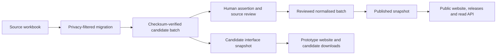

# Snapshot and export pipeline

Status: implemented for candidate prototype data  
Last updated: 30 July 2026

## Purpose

The website, downloadable files and future read API must describe the same
records. They are generated together from one selected, checksum-verified data
batch.

The current snapshot is deliberately in `candidate` mode. It allows the
interface and export workflow to be tested without presenting the workbook
migration as reviewed or published data.

## Data flow



The generator never edits the source workbook and never reads the workbook at
website runtime. Workbook import remains a separate, reviewable migration step.

## Configuration

[`data/interface-snapshot.json`](../data/interface-snapshot.json) selects:

- `candidate` or `published` mode;
- the release label and date;
- one normalised source batch;
- the taxonomy, country reference and presentation metadata;
- the generated website snapshot; and
- the versioned download directory.

[`data/interface-presentation.json`](../data/interface-presentation.json)
contains market-condition and research-state wording. Those are editorial
presentation decisions, not evidence imported from the workbook.

[`data/african-countries.json`](../data/african-countries.json) provides the
complete 54-country reference used by country navigation. A country with no
candidate deployment remains distinguishable from a country assessed as zero.

## Promotion gate

`candidate` mode is permitted while review is incomplete, but the interface and
downloads must display that status.

`published` mode is refused unless:

1. every assertion has both `reviewed_by` and `reviewed_at`;
2. every source has a resolved title;
3. every source has a resolved licence; and
4. at least one assertion exists.

The current batch contains:

- 3 organisations;
- 5 products;
- 4 deployments;
- 4 sources;
- 88 assertions;
- 0 reviewed assertions; and
- 4 sources requiring metadata completion.

It is not publishable. Changing the word `candidate` to `published` in
configuration does not bypass the gate.

## Generated interface snapshot

Run:

```bash
python3 scripts/build_registry_snapshot.py
```

The command writes
[`web/generated/registry-snapshot.json`](../web/generated/registry-snapshot.json).
The application adapter in
[`web/lib/registry-data.ts`](../web/lib/registry-data.ts) is the only place
where generated field names are converted into display labels.

The snapshot includes:

- release and source-workbook provenance;
- review-gate status and record counts;
- organisations, products, deployments, sources and assertions;
- the value-chain taxonomy and presentation metadata;
- all 54 African country references;
- derived country summaries; and
- versioned download links.

The website must not maintain duplicate product, organisation or deployment
records in component code.

## Download package

The same command writes
`web/public/downloads/<version>/`:

| File | Purpose |
| --- | --- |
| `candidate-csv-package.zip` | Normalised tables, metadata, licence, migration report and internal checksums |
| `registry.json` | The exact structured snapshot consumed by the interface |
| `assertions.jsonl` | One source-linked assertion per line |
| `deployments.geojson` | Country-safe deployment properties with null geometry |
| `manifest.json` | Version, counts, review status, file sizes and SHA-256 hashes |
| `checksums.txt` | Integrity hashes for the downloadable files |
| `README.md` | Human-readable status, contents, counts and limitations |

ZIP entry ordering, timestamps and JSON formatting are fixed so an unchanged
source batch produces byte-identical files.

GeoJSON does not contain point coordinates. A country identifier and safe
subnational label are sufficient for this phase.

## Reproducibility and validation

Run:

```bash
python3 scripts/build_registry_snapshot.py --check
python3 scripts/validate_repository.py
python3 -m unittest discover -s tests -v
```

The checks fail if:

- the selected batch differs from its checksum inventory;
- a batch file was added or removed without updating that inventory;
- the committed website snapshot or downloads are stale;
- published mode is selected before review is complete;
- generated downloads are not deterministic; or
- geographic output contains precise coordinates.

Repository validation calls the snapshot check, so CI detects source changes
that were not followed by regeneration.

## Updating the data safely

1. Import or edit a bounded candidate batch through a pull request.
2. Complete source metadata and assertion-level human review.
3. Run the migration and repository validation suites.
4. Point `data/interface-snapshot.json` at the reviewed batch.
5. Generate the snapshot and downloads.
6. Review the data diff, counts, status and rendered interface.
7. Merge only after editorial approval.
8. Tag an immutable data release when the snapshot is in `published` mode.

People and private submission fields are excluded from the snapshot and public
downloads. Autonomous agents may prepare steps 1–5 on a branch, but may not
approve, merge or publish their own work.

## Future service boundary

At larger scale, a versioned read service can return the same snapshot objects
or paginated subsets. Public URLs, filter terms, evidence labels and export
fields should remain stable. Replacing the file-backed reader must not weaken
the promotion gate or allow the website to query research queues directly.
