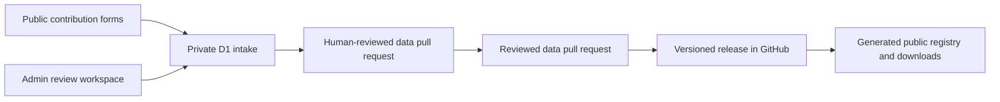

# Production backend, admin access and custom domain

Status: launch architecture implemented; public access and custom hostname
await owner approval

Last updated: 31 July 2026

## The production shape

The application deliberately uses two different data stores:

GitHub is the canonical public record. It holds the taxonomy, reviewed tables,
assertion-level sources, release history, checksums and downloadable snapshots.
The public website reads the generated release bundle; it does not query mutable
moderation tables.

Managed D1 is the private operating database. It stores contributions, private
contact rows, abuse counters, assertion and source decisions, audit events,
operations settings, maintenance runs and bulk-import candidates. D1 cannot
publish or directly edit the public registry.

This separation keeps public data reproducible and exportable while allowing
moderation and review to be interactive.

## D1 tables

| Boundary | Tables | Public exposure |
| --- | --- | --- |
| Contribution intake | `contributions`, `contribution_rate_limits` | Receipt status only, with the private receipt secret |
| Private contact | `contribution_contacts` | Explicit admin reveal only |
| Editorial review | `assertion_reviews`, `source_reviews`, `review_audit_events` | Admin workspace only |
| Operations | `system_settings`, `maintenance_runs` | Protected health and admin operations views |
| Bulk intake | `bulk_imports`, `bulk_import_rows` | Admin workspace only |

All database access runs on the server through the logical `DB` binding.
Browser code never receives database credentials. SQL is parameterised, writes
are bounded, and multi-record operations use D1 batches.

Schema changes require a numbered migration in `web/drizzle/`, review of the
generated SQL, a full application test, and a new saved site version. The
current schema has four ordered migrations.

## Contact retention and recovery

Contact email is stored separately from contribution content. The live row is
marked for deletion after 150 days and the daily maintenance job purges expired
rows. This accommodates a managed point-in-time recovery window of up to 30
days while keeping total potential recoverability within the stated 180-day
maximum.

D1 provides managed point-in-time recovery, but public launch still requires an
operator restore drill and confirmation of the recovery window on the actual
Sites-managed database. Longer-lived encrypted exports should be added only
through a supported managed path; private database exports must never be added
to GitHub artefacts.

## Admin sign-in

The admin entry point is `/review`.

1. An anonymous visitor is sent to the platform-owned **Sign in with ChatGPT**
   flow.
2. The platform supplies the authenticated email to the server.
3. The server compares that email against the secret `REVIEWER_EMAILS`
   allowlist.
4. An unlisted account receives a denial page.
5. An allowlisted account receives the review, moderation, bulk intake and
   operations workspace.

Authentication identifies the account; the server-side allowlist grants admin
authority. Every admin API repeats the same authorization check. Hiding the
admin link is not a security control.

`REVIEWER_EMAILS` and `OPERATIONS_TOKEN` are production secrets managed by
Sites. They do not belong in Git, browser storage, build output or client-side
environment variables. The admin page is dynamic, `noindex`, and `no-store`.

The public registry, map, directory, downloads and contribution forms require
no account after the site access policy is changed to public. Admin access
remains signed-in and allowlisted.

## Custom-domain procedure

One canonical hostname should be selected before changing public access. A
subdomain such as `map.example.org` is usually simpler than an apex domain,
while an apex such as `example.org` may require A records and separate `www`
redirect handling.

The production sequence is:

1. Confirm the exact canonical hostname and DNS provider.
2. Add that hostname to the existing Sites project.
3. Copy the returned ownership-validation and routing records exactly into DNS.
4. Wait for DNS propagation and refresh domain validation until it is active.
5. Set `NEXT_PUBLIC_SITE_URL` to the final `https://` hostname in Sites.
6. Save and deploy a version so canonical, Open Graph and social URLs use the
   custom hostname.
7. Test the home page, downloads, contribution submission, private receipt,
   `/review` sign-in, admin APIs and sign-out on the custom hostname.
8. Choose whether the old `chatgpt.site` hostname remains an accepted fallback
   or is treated only as an operational URL.
9. Change the Sites access policy from owner-only to public only after an
   explicit owner approval.

Do not place a proxy in front of the site unless it preserves HTTPS, the
original host, the platform authentication routes and the authenticated-user
headers. DNS validation records are supplied by Sites and must not be guessed.

## Launch issue disposition

| Issue | Current position |
| --- | --- |
| Durable contribution intake | Implemented and tested; close the stale issue |
| Moderation and privacy operations | Core implementation is live; keep open for restore drill, external monitoring and incident exercise |
| Production dependency audit | Patched dependencies, disabled unused image optimisation and enforced the audit in CI |
| Beta scale and accessibility | Synthetic scale guard exists; keep open for moderated user, keyboard, screen-reader and slow-network testing |
| Autonomous research | Policy-only dry run exists; keep open until an approved source and least-privilege GitHub App are configured |
| Batch 002 | Planned but not researched or human reviewed; keep open |

## Public-launch gate

Before changing the access policy to public:

1. merge and deploy the dependency and operations hardening pull request;
2. run the D1 restore drill without production data loss;
3. confirm the daily maintenance workflow and external uptime alert;
4. complete keyboard and screen-reader checks;
5. complete at least one moderated test with a researcher, utility user and
   provider;
6. activate the custom hostname and test admin sign-in there;
7. confirm privacy, licence and contribution wording; and
8. record explicit owner approval for public access.

